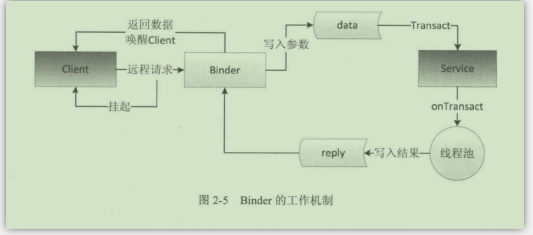

#AIDL 跨进程通信总结


最近几天系统的看了下android跨进程通信的一些方式，主要的一个部分就是通过AIDL，利用binder进行跨进程通信。

###跨进程通信的方式
1. 共享文件(包括sharedpreferences)
2. 共享内存
3. socket
4. AIDL(Messager，ContentProvider，普通aidl)

###AIDL介绍
首先aidl并不是一个通信方式，aidl只是一个android接口规范语言，用来生成最后实际需要的java类。
下面是主要注意点：

* 配置

在androidstudio中，aidl文件夹和java文件夹并列，如果在aidl文件夹中有java文件的话，需要在gradle中配置

```
 sourceSets {
        main {
            java.srcDirs = ['src/main/java', 'src/main/aidl']
        }
    }
    
```
其实通过aidl最后生成了一个继承自binder的stub类，我们最终将这个类的对象通过service的onbind 方法给了系统。

* binder工作的流程图



binder对象不管是在服务端还是客户端，都是运行在一个binder线程池中的，所有通过binder的调用都是同步的，如果调用方在ui线程则，注意anr情况。

* 观察者模式

如果要实现观察者模式，比如客户端注册监听到服务端，则需要注意，由于是两个进程，所以设置的listener在客户端和服务端其实为两个对象，所以如果要取消注册，则需要使用RemoteCallbackList来进行。

这里有个不好理解的地方，最早的时候，我没有把这个listerner当作一个binder，这样就有疑问，那么一个binder是怎么对应一个多个listener的。后来看到代码的地方，恍然大悟，原来listener本来就是一个binder，所以客户端的每一个listener，注册到服务端后，都对应新的biner，然后写入到这个map中。

* binder死亡，做好重连机制
两种方式
 * 通过binderDied方式
 * 通过servicediscontented
	
* 权限机制

可以通过在service中的onTransact方法中进行权限判断，筛选调用者。
这里android在mainfest中有自定义权限的机制。


* binder连接池（与自生binder线程池区分）
	
服务端service提供一个查询接口，将不同客户端的binder对象进行返回。客户端维护一个单例，然后单例通过绑定服务端后，通过服务端的额查询接口，给不同的调用端提供不同的binder。

* 并发问题
	
客户端在多线程中调用服务端binder接口的时候，服务端binder可能运行在不同的biner线程，但是服务端的binder是一个对象，所以存在并发问题，需要处理变量同步问题。


